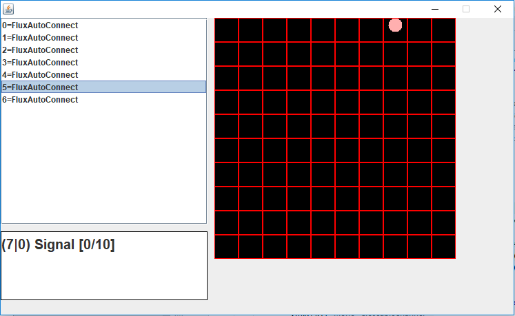
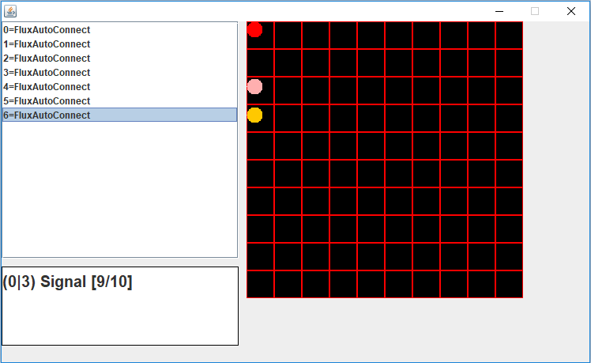

# Reactive-Streams
This project is a result of my bachelor [Thesis about reactive programming](https://github.com/Menkir/reactive-streams-tex/blob/master/thesis.pdf). It has two implementations. First one in an reactive manner and second one in an blocking manner.
It's recommended to familiarize yourself with the thesis, before you start looking this code.

The Javadocs of this Project are [here](https://menkir.github.io/reactive-streams/java/index.html)

The Scaladocs of this Project are [here](https://menkir.github.io/reactive-streams/scala/index.html)

| Date of Submission |
|--------------------|
| 28.02.2019         |

## Test
The sync package contains the implementation of a synchronous Server and Client. The async package contains the implementation of the reactive Server and Client.
If you want to test the reactive or synchronous server implementation you need to start a CarServer Instance.
 The Servers are located in `prototype.asnyc/sync.server`. 
 After you started the server you need to run the Test. 
 Depending on which Server you started (reactive or sync) you need to run the corresponding Scalatest 
 AsyncSimulation or SyncSimulation in the ``benchmark`` package.
 
 Each Simulation starts ten Futures as Clients (Car) and measures the Flow of successfully processed requests.
 After testing it will be a txt file generated with measure-details.
 
 Be aware that the reactive Server and Client only run on ``Java 8``. 

## Graphic User Interface
If you want to checkout the GUI you need to switch to the [gui branch](https://github.com/Menkir/reactive-streams/tree/gui). The reason why the gui is on a separate branch is, because it's not part of the core-software. 
It's more like a extension, where you can see, whats happening with incoming measurements from Car. The Main-Method of the reactive Server (prototype.async) instantiate a Monitor JFrame and get incoming Measurements in a reactive manner. 
The ui is only available for the reactive Implementation, because it handles incoming Measurements in reactive manner. 

